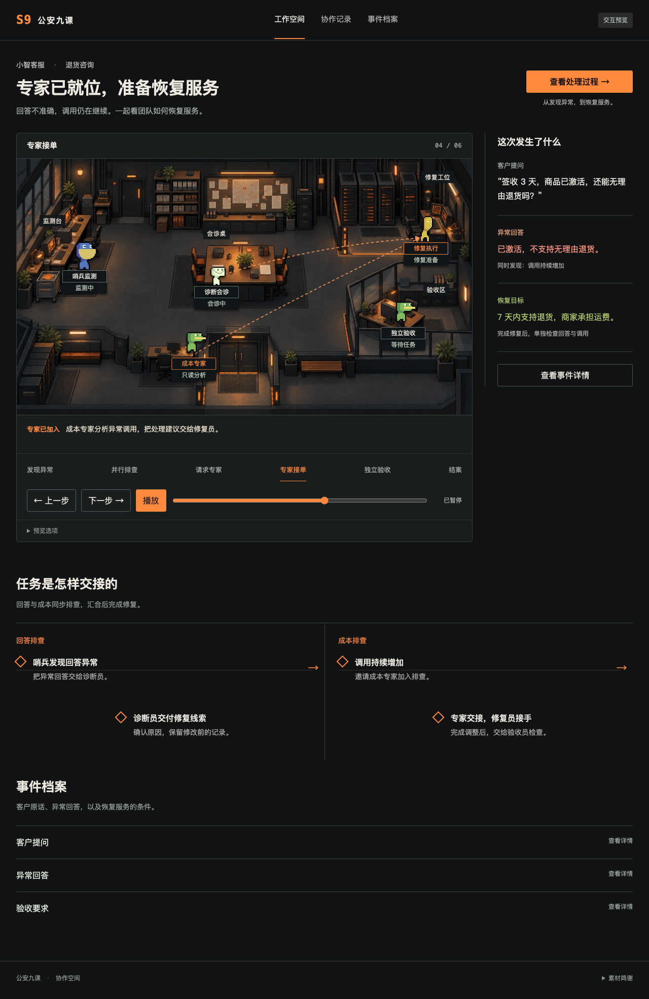

# Section9：面向 AI 应用的可验证自治运维蜂群

## 当前演示入口（2026-09-24）

打开 **[Section9 主线工作台](http://127.0.0.1:9160/demo)**：自由业务任务 → 应用侧 Langfuse → 原生 EvoMap 会话协作核查 → 人工审核/退回 → 同证据 single/swarm。复用原业务应用、v1 对象、前端和办公室组件。

先读 **[接力交接](docs/implementation/HANDOFF.md)**、[主线边界](docs/implementation/DEMO_MAINLINE.md) 和 [真实验收摘要](docs/implementation/DEMO_ACCEPTANCE.md)。本轮 337 项后端测试通过，真实 native 会话/接力及审核版本闭环已验证；single 对照更快、更省，尚不能宣称 swarm 质量胜出。这里只完成到调查建议审核，完整产品/生产执行仍未完成。

下面小智/Pair/旧产品路径保留各自历史。旧文中“远端会话未验收”的结论限当时快照，当前 E2 session transport 状态以上述验收为准，Hub/PDRI 仍未验收。

---


Section9 的目标是让 AI 应用团队连接运行证据、代码与受控执行环境，由不同 Agent 协作调查异常、提出可审查的修复方案，并在明确权限内执行与独立验收。用户最终拿到的是一份可追溯的事故处理记录：异常影响了什么、哪些证据支持根因、成员如何解决分歧、实际修改了什么，以及业务是否在生效版本上恢复。

典型场景是客服或 RAG Agent 升级后仍返回 HTTP 200，却因工具契约变化开始答错、重复调用并增加成本。轨迹、代码和业务质量成员分别调查，交换带来源的线索；修复者提交方案，独立复核者检查原故障与正常样例。系统只允许经策略和审批授权的动作，执行后再用业务探针观察结果。简单任务也可能由单 Agent 更快、更省，因此 Section9 用同条件对照报告质量、耗时和总成本，不预设蜂群必胜。

## 目标范围与当前状态

最终范围包括事故发现与处置、代码审查、成本优化、基础设施、安全评估、自动化、知识与经验、团队治理等工作流。[展示规划](docs/SHOWCASE_PLAN.md)说明完整范围与展位主线的关系；功能存在、产品可交付、蜂群效果分别验收。近期先完成真实应用事故闭环与可复核的蜂群对照，不把全平台目标写成现有能力。

**当前可运行的是本机 macOS 控制面**：固定小智示例应用的真实模型故障实验、独立验收和同案 Pair 双屏；另有首个外部 `support-agent` 候选的本地测试工作区与有限业务真值探针。模型推理依赖远程 EvoMap API。本地权限、租约/fencing、事件和证据导出已有实现；官方 EvoMap 远端协作会话、能力发现、Hub 发布/检索及完整多场景蜂群优势尚未验收。[交付矩阵](docs/PRODUCT_DELIVERY_MATRIX.md)记录具体证据和缺口，[当前演示指南](docs/DEMO.md)给出可复跑路径。

**展示主线**：评委触发一件 AI 应用故障 → 查看成员交换线索、反证与接管 → 审查受控修复 → 打开独立业务验收 → 查看同案单 Agent 对照和原始运行证据。网页中的办公室只映射真实任务事件，不能代替证据。最终展示脚本、网页信息架构、提交物和实验口径见[展示规划](docs/SHOWCASE_PLAN.md)。

## 当前本机界面



上图是 2026-09-22 的独立预览，展示的是当时的界面，不是最终产品或本次实时运行证明。[预览源码与启动方式](frontend/public/preview/README.md)和[UI 整理记录](docs/PRODUCT_UX_POLISH.md)保留其历史身份。实际运行版由后端事件驱动。

办公室复用 Star-Office-UI 固定版本的完整房间、桌椅与角色素材，真实状态接入 Section9。点击房间里的角色查看本轮任务与消息。2026-09-22 改版实测和复用边界见 [办公室验收记录](docs/OFFICE_DELIVERY.md)。

当前入口（本机）：

- 操作台：<http://127.0.0.1:9019>
- 蜂群只读展屏：<http://127.0.0.1:9019/showcase/swarm>
- 单 Agent 只读展屏：<http://127.0.0.1:9019/showcase/baseline>
- Worker/Agent API：<http://127.0.0.1:9021>
- 独立 evaluation 进程：<http://127.0.0.1:9024>
- evaluation worker 进程：<http://127.0.0.1:9026>
- attract 导览进程：<http://127.0.0.1:9020>
- attract worker 进程：<http://127.0.0.1:9022>
- 本地 Langfuse：<http://127.0.0.1:9030>
- Collector OTLP/HTTP：<http://127.0.0.1:9431/v1/traces>

业务运行前需要在受保护位置配置远程模型 key；已安装的服务可以在空 key 下读取本地历史。安装脚本会获取并校验固定版本的角色素材；LimeZu 原始图集不在此仓库再分发，详见素材归因。普通角色不读取操作台 SSE、全量日志、当前场景真值或其他角色的私有推理。Jev 当前 disabled；EvoMap Hub 发布与远端检索尚未实现，不是登录后即可启用；推理使用远程 EvoMap Luna API，并非本地或断网推理。

## 双屏 Showcase

两个展屏对应一个 Pair 的两套独立运行实例，分别保存配置、任务、权限、usage 与验收；并发准入共享，预算独立。页面只读，打开或刷新不启动模型请求。原 `/` 侧栏的 Pair showcase 可创建、开始或重置；创建后先打开 SWARM 和 BASELINE 固定链接，再点击“开始”。重跑必须创建新 Pair，旧失败和中断不会覆盖。

七阶段、角色位置、日志和底部五个证据抽屉由真实事件投影。单 Agent 基线只显示一个推理角色。完整契约见 [Showcase 架构](docs/SHOWCASE_ARCHITECTURE.md)，版本、原始实测、截图和限制见 [本次双屏交付](docs/SHOWCASE_DELIVERY.md)。

```sh
./scripts/start.sh                            # 启动
./scripts/showcase-acceptance.sh               # 完整复跑，会消耗远程模型预算
.venv/bin/python scripts/reset-showcase.py     # 重置当前 Pair；保留历史
```

原控制台的 `scripts/reset.sh` 只重置原控制台，不会重置 Showcase 的 Pair。

## 启动与停止

新克隆需要 Python/uv 和 Node.js/npm；观测栈需要 Docker Desktop。先执行 `./scripts/install.sh`，再在本机 `.env` 填入自己的 `EVOMAP_MODEL_API_KEY`。初始化仅创建缺少的文件，保留已有配置；密码随机生成并以 0600 保存。详细说明见 [本地配置](docs/LOCAL_SETUP.md)。模型推理使用远程 EvoMap API。

```sh
cd section9
./scripts/start.sh
./scripts/reset.sh
./scripts/stop.sh
```

`install.sh` 负责锁定依赖、构建和可选素材下载；`start.sh` 只启动已安装的应用，不联网安装。`python3 scripts/doctor.py --json` 做只读体检；`python3 scripts/readiness.py --business` 才发起付费业务探针。观测栈用 `scripts/infra-start.sh` 显式启动；`stop.sh` 停止本项目应用与观测 Compose 并保留卷，`stop.sh --app-only` 只停应用。evaluation 单独启动：

```sh
./.venv/bin/python scripts/environments.py start
./.venv/bin/python scripts/environments.py status
```

Evaluation 使用独立的 `data/evaluation`、9024 API 和 9026 worker 进程；attract 使用独立的 `data/attract`/memory 边界、9020 API 和 9022 worker，激活后最多三轮，每轮目标 90 秒。

## 观测与配置

本地 Langfuse 使用官方 v4 Docker 组件，OTLP Collector 将 span 分别排入 backend 与 Langfuse 队列。Langfuse v4 的本地页面在 [9030](http://127.0.0.1:9030)，官方说明见 [Docker Compose 部署文档](https://langfuse.com/self-hosting/deployment/docker-compose) 与 [OpenTelemetry 集成文档](https://langfuse.com/integrations/native/opentelemetry)。

真实 key、数据库密码、headless 初始化凭据只在 `infra/.env`（权限 0600，已被 gitignore）中保存；模板只有空变量名，见 [.env.example](.env.example)。不要把 `infra/.env`、模型 key 或 worker token 放入 README、截图、日志或提交。

检查真实 span：

```sh
./.venv/bin/python scripts/check-telemetry.py --run-id <本次运行的run_id>
```

它读取本地 Langfuse v4 Observations API，严格匹配指定运行的完整 trace_id，并将记录写入 `artifacts/telemetry/`。旧 LF-only 记录不能证明 Collector→控制端贯通；最终以 root 生成的同 trace_id 双侧入库报告为准。它不会用测试 POST 200 伪造“已观测”。

## 当前整改与验收

2026-09-22 独立审查后的阶段一在 `codex/local-product-readiness` 实施，范围为验收授权、重启结算、禁言决策、运行入口、控制作用域和完整日志导出。当前验证与未完成边界见 [阶段一记录](docs/LOCAL_PRODUCT_STAGE1.md)。下列旧验收报告均绑定各自源码身份，不代表新版本已通过。独立新 Mac 冷安装仍待测。

本轮修复跨事故 lease、迟到消息/计划、错误模型 JSON、reset 在途取消、业务答案与成本验收、启动身份、计分屏未知用量及版本分组。最新实测、失败记录和复现入口见 [审查整改报告](docs/AUDIT_REMEDIATION.md)。计分屏默认只显示当前实现版本；缺少完整源码绑定的旧记录单列为 legacy。

一条验收命令：`./scripts/acceptance.sh`。它会真实调用远程模型、操作浏览器、短暂停止/恢复本项目 Collector，并保留一轮故意 reset 的 evaluation 失败与未知 usage。该安全实验不是性能样本；不会从统计中删除。四类正常故障中任何一轮失败、来源不一致或双路遥测不匹配，命令均返回非零。

## 历史版本证据（不可视为当前版本通过）

整改前历史 evaluation 共 36 次：`single` 8/8、`muted` 7/8、`swarm` 12/12（每格 3 次）、`memory` 8/8，合计 35 pass、1 个 muted/composite 失败。失败和 unknown usage 均保留在原始 run 文件中；小样本不能推出任何条件优势。`memory_jev` 因 Jev 未启用保持待测，不能用 `single_memory` 替代。evaluation 使用 frozen seed snapshot，结果写回独立 evaluation-results；真实 demo memory 记录单独看待，不能与 frozen evaluation 混算。

```sh
cd section9
./scripts/acceptance.sh
./scripts/reset.sh
```

模型为远程 `evomap-gpt-5.6-luna`，不是本地推理。真实官方 GEP SDK 与本地 authority 已接入，但不冒充 EvoMap 官方 native swarm；Hub 远端发布/检索未实现，Jev 未启用。浏览器验收已实际检查权限、接管、旧 grant 拒绝和 reset；四类 integration 检查多次通过。

历史新增 4 次 swarm 的实测耗时为 18.963、19.932、21.215、21.221 秒。Attract 9020 已完成 3 次闭环：19.867、21.611、20.710 秒，总运行 278.831 秒；业务验证、主配置/事故/evaluation score/memory 不变、自动调用停止和独立进程/database/memory 检查均通过，共享同一台 Mac，非硬件隔离。

真实 demo memory 已连续两次复用同一 playbook：19.157、18.481 秒，2/2 成功、`reuse_count=2`；reset 实测 0.063 秒。离线 OS 阻断实测得到真实 `ConnectError`、usage `null`/`unknown`，本地控制状态与 memory 仍可读；这不是本地推理证明。warm-cached image stop/start 的启动实测见 `artifacts/startup/report.json`，首次下载未测。

交付图像和视频的来源审计见 [docs/STAR_OFFICE_SOURCE_AUDIT.md](docs/STAR_OFFICE_SOURCE_AUDIT.md) 与 [docs/STAR_OFFICE_ATTRIBUTION.md](docs/STAR_OFFICE_ATTRIBUTION.md)：代码/逻辑按上游 MIT 说明，角色和其他美术资产仅限非商业示范。A3 海报和 90 秒原速历史录屏位于 `artifacts/delivery/`，字幕非实时。成员资料、如需 Hub 闭环还需开发与授权，商业素材权利仍由用户处理。

完整交付结果、实测表格、限制和证据路径见 [交付说明](docs/DELIVERY.md)，操作顺序见 [演示指南](docs/DEMO.md)。历史同 trace_id 双路遥测曾核对 8 条；当时 55 项组件/边界检查通过，实际浏览器与模型闭环另有原始记录。服务启动会申请跟随本项目进程的 macOS 防空闲睡眠状态；停止服务后自动释放，不修改系统电源设置。
