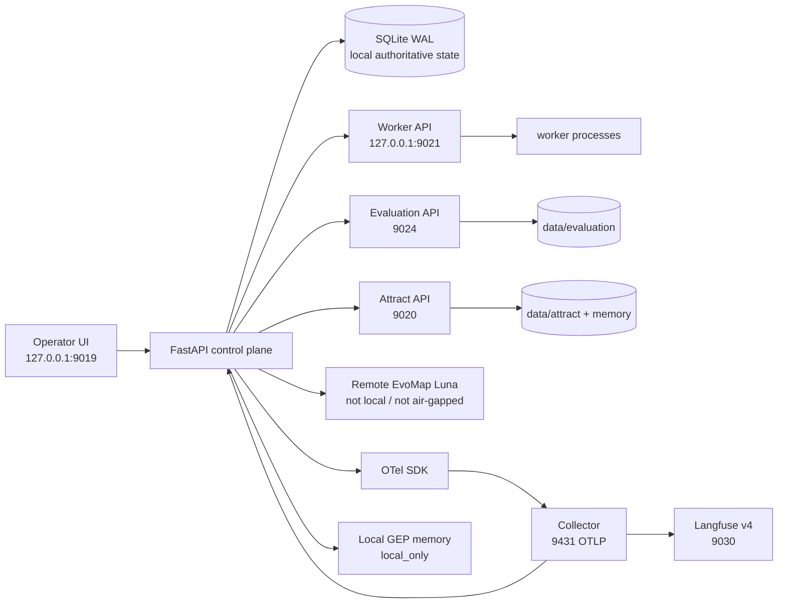

# Section9 架构与边界

## Ownership and data paths

The control plane owns revisions, generations, leases, approvals, fencing, reset, event sequencing and authoritative run records. Worker processes can only use scoped `/agent` endpoints and never receive the model provider key. SQLite WAL is the local consistency choice; no external network or model call runs inside a transaction.

The victim/model path makes the real remote request and records usage, elapsed time and trace id. Telemetry is a separate diagnostic path: OTel spans fan out through the local Collector to the root backend `/api/telemetry/v1/traces` and local Langfuse `/api/public/otel/v1/traces`. Langfuse does not decide whether a run passed, whether a plan may execute, or whether a playbook may be learned.

Evaluation and attract are separate OS processes with separate ports and data/memory roots. They are isolated by process/configuration boundaries on one Mac; this is not a claim of hardware or tenant isolation.

## Official components and project-owned code

Official components: FastAPI/Uvicorn, OpenTelemetry Python SDK/exporter, OpenTelemetry Collector contrib, Langfuse v4 web/worker, PostgreSQL, ClickHouse, Redis and MinIO. They provide serving, tracing transport, observability storage and supporting persistence.

Project-owned code: Section9 control state machine, worker role protocol, safety/fencing, victim tool loop, independent probes, local GEP memory gate, evaluation runner, attract lifecycle and UI. AgentMED material is retained as workload provenance and can be followed through [docs/ASSET_PROVENANCE.md](ASSET_PROVENANCE.md); it is not a runtime authority or external deployment.

## External boundary

The current model endpoint is remote EvoMap Luna-compatible inference. `remote_inference=true` is intentional and does not imply local inference, offline operation, or provider-cache control. EvoMap Hub registration/publication and Hub OAuth are outside this local run; OAuth is pendingauth and all memory assets remain `local_only`.
